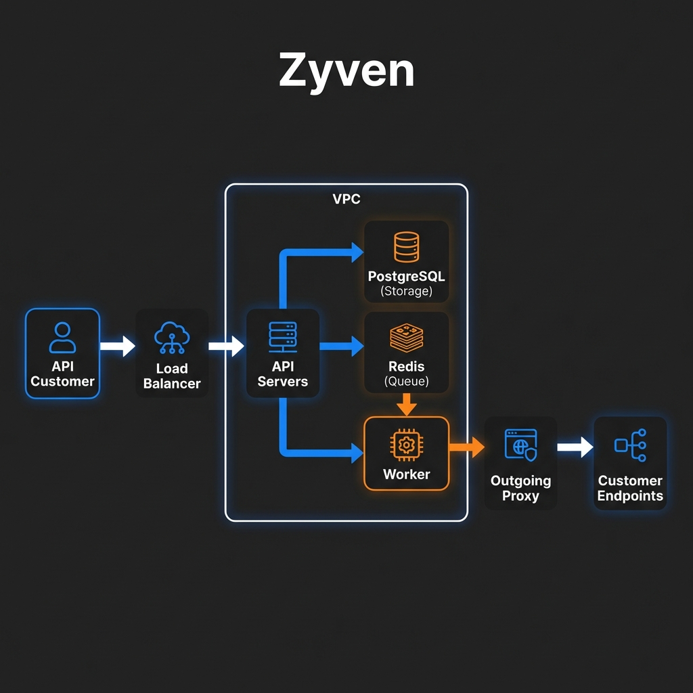
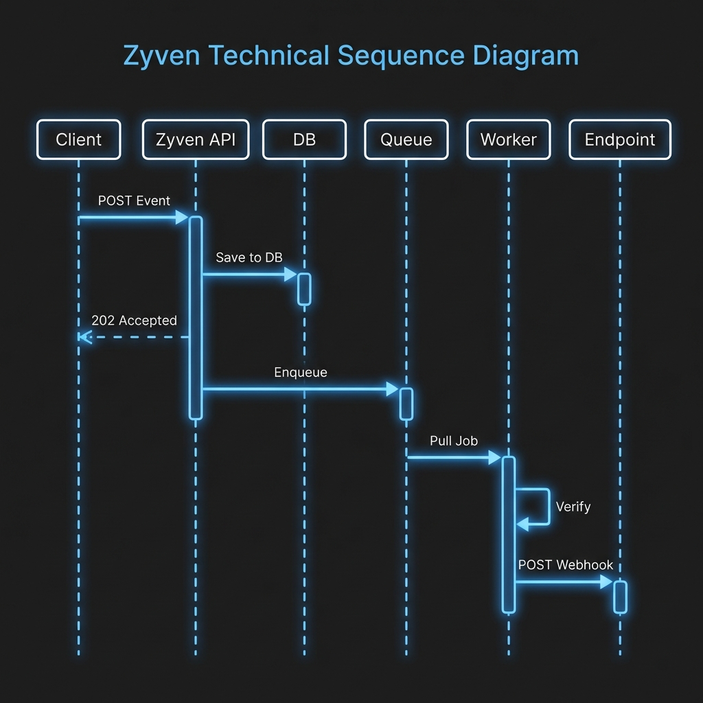
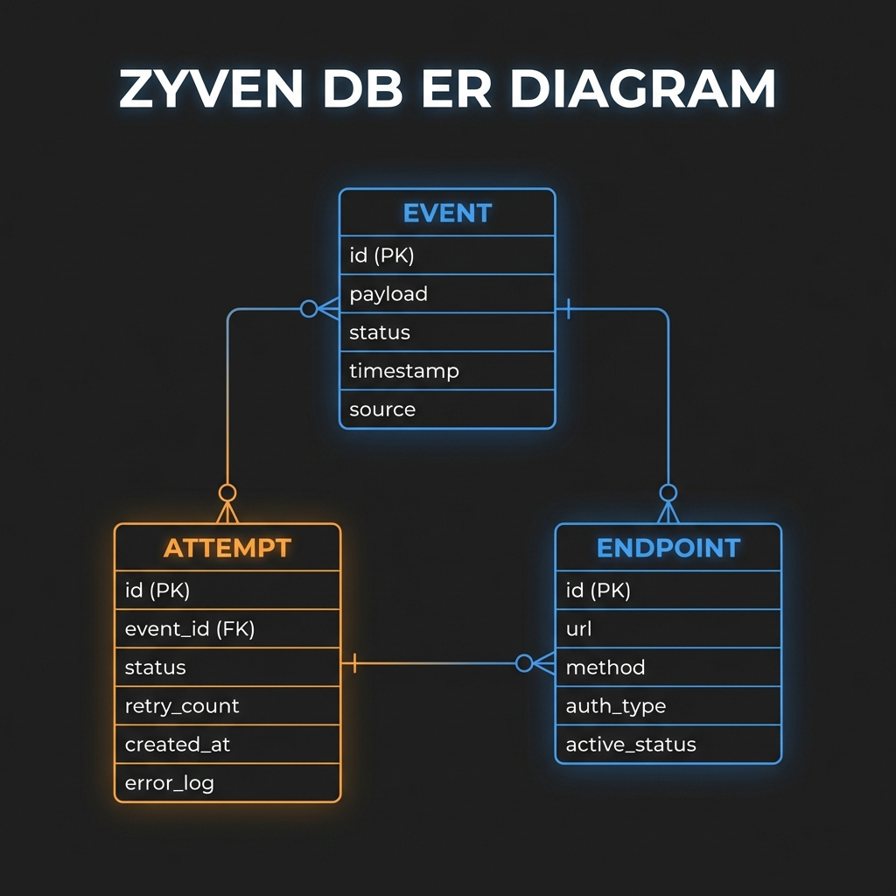

# ⚡ Zyven: Enterprise-Grade Reliability Middleware

Zyven is a high-performance **Reliability Middleware** designed to sit between your application and external webhooks. It guarantees delivery, provides deep visibility, and ensures automatic recovery for mission-critical event-driven architectures.

---

## 🧐 The Problem
In modern distributed systems, calling external webhooks directly from your core services is risky:
- **Downstream downtime** causes data loss.
- **Network flickers** lead to failed notifications.
- **Lack of visibility** makes debugging hard.
- **Manual retries** are error-prone and tedious.

## 🛡️ The Zyven Solution
Zyven acts as a shock absorber for your events. It separates **Acceptance** from **Delivery**.
1. **Acceptance (Sync)**: Rapidly persist the event and acknowledge the client.
2. **Delivery (Async)**: Intelligently manage retries, idling, and delivery guarantees.

---

## 🏗️ High-Level Architecture
Zyven uses a decoupled, VPC-isolated architecture to ensure high availability and security.

---

## 🔄 End-to-End Flow
The lifecycle of an event from ingestion to final delivery (or DLQ).

---

## 📊 Database Schema (ER Diagram)
Zyven's data model is optimized for high-volume event tracking and auditability.

---

## � Key Features

- **✅ At-Least-Once Delivery**: Guaranteed event delivery even if the receiver is temporarily down.
- **✅ Idempotency Protection**: Built-in mechanisms to prevent duplicate processing.
- **✅ Bounded Retries**: Intelligent exponential backoff with configurable jitter.
- **✅ Dead Letter Queue (DLQ)**: Failed events are routed for manual inspection and replay.
- **✅ Webhook Signing**: Every delivery includes an HMAC signature for security.
- **✅ Real-time Monitoring**: Full audit logs for every delivery attempt.

---

## 🔍 Visual Deep Dives
For a more detailed look at the internal logic of Zyven, check out our explainer guides:
- [🧠 Technical Explainer & Logic Flows](docs/explainer.md): Detailed diagrams for Retries, Idempotency, and Security.
- [🏗️ System Architecture Theory](docs/architecture.md): High-level design principles and security strategy.

---

## 🛠 Tech Stack

- **Frontend**: [Next.js](https://nextjs.org/) + [TypeScript](https://www.typescriptlang.org/) + [Tailwind CSS](https://tailwindcss.com/)
- **Backend**: [Node.js](https://nodejs.org/) + [Express](https://expressjs.com/)
- **Database**: [PostgreSQL](https://www.postgresql.org/) (Prisma/Drizzle)
- **Queue/Jobs**: [Redis](https://redis.io/) + [BullMQ](https://github.com/RedisBull/bullmq)
- **Security**: [SSRF Protection](https://en.wikipedia.org/wiki/Server-side_request_forgery) via Outgoing Proxies

---

## 📄 License
Distributed under the MIT License. See `LICENSE` for more information.

---

## ✉️ Contact
**Sultan Alam** - [sultanalamdev@gmail.com](mailto:sultanalamdev@gmail.com)  
Project Link: [https://github.com/sultanxdev/zyven](https://github.com/sultanxdev/zyven)

---
*Built with ❤️ for reliable webhooks.*
