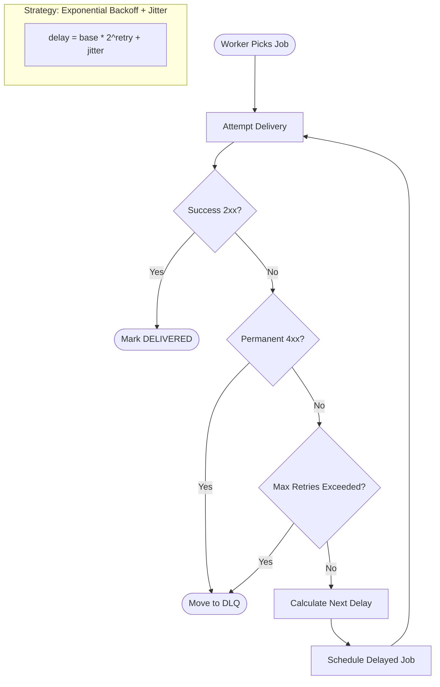
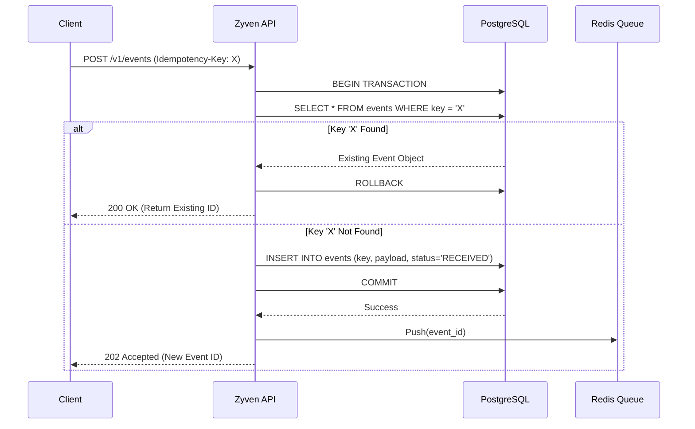
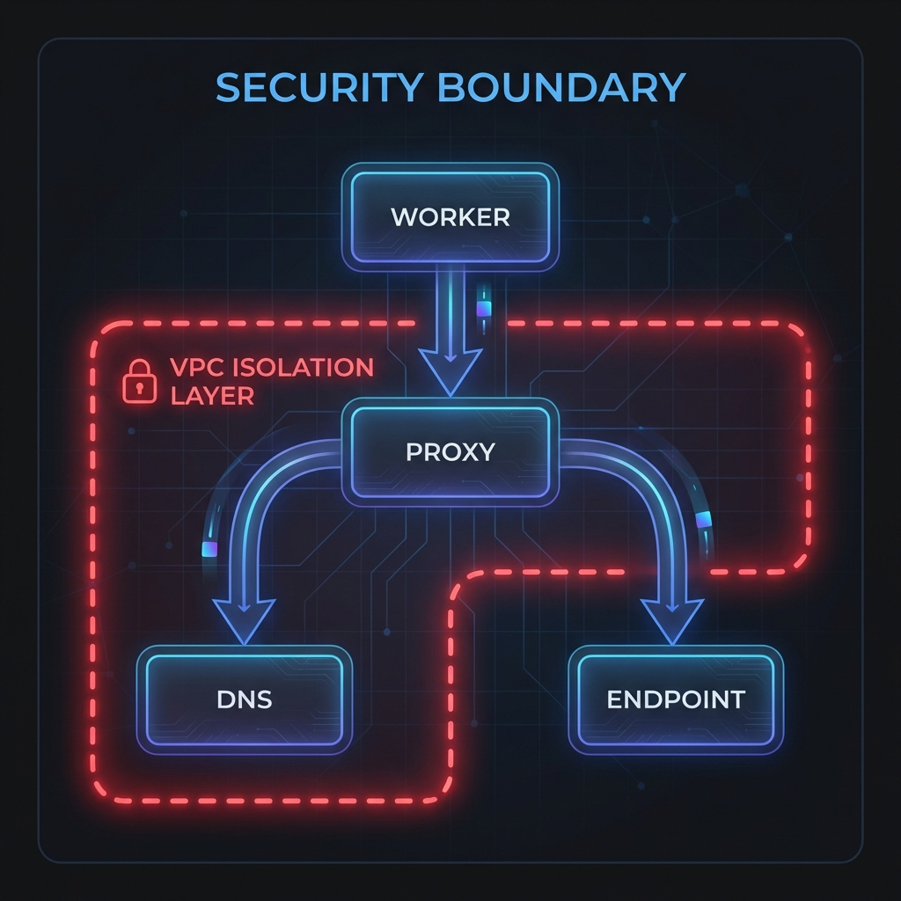
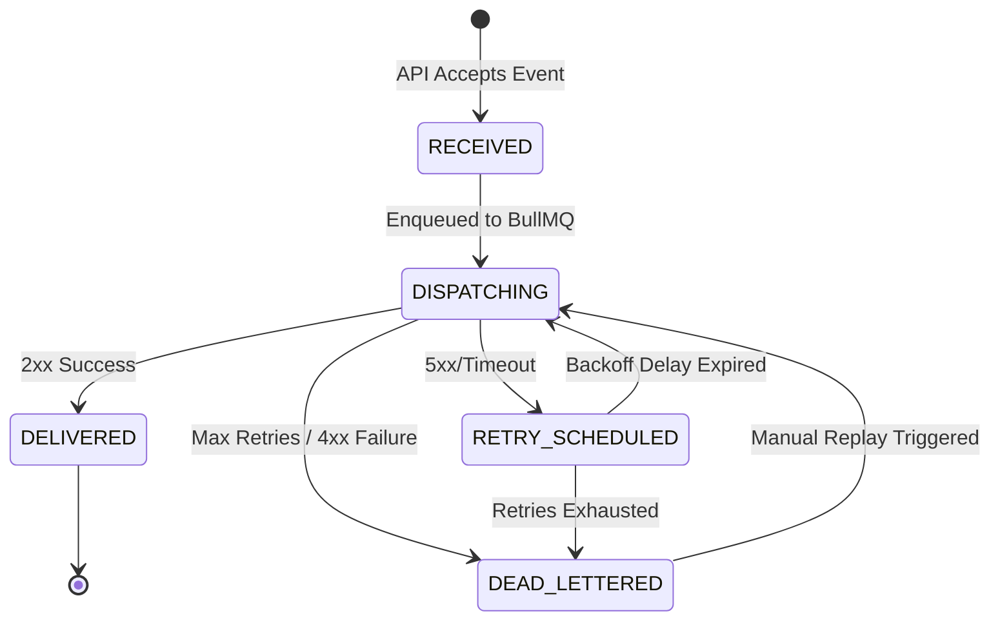

# 🧠 Zyven: Technical Explainer & Logic Flows

This document provides detailed visualizations of the core engineering logic within Zyven. It covers retry mechanisms, idempotency, security, and the internal state machine.

---

## 1. Retry & Backoff Logic
Zyven uses an **Exponential Backoff with Jitter** strategy to prevent overwhelming downstream services.

---

## 2. Idempotency Enforcement
Zyven ensures that a single event is never processed multiple times, even if the client retries the ingestion request.

---

## 3. Security: The Outgoing Proxy (SSRF Protection)
Zyven protects your infrastructure by ensuring workers never make direct network calls to untrusted external URLs.

---

## 4. Event Lifecycle State Machine
Every event in Zyven transitions through a well-defined set of states.

---

[Back to Architecture](architecture.md) | [Back to Main README](../README.md)
